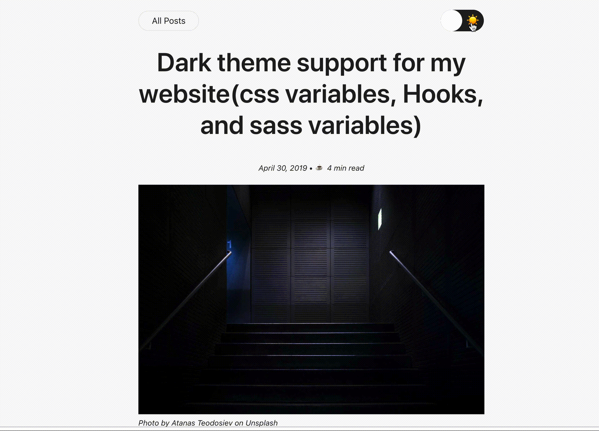

<i>Photo by Atanas Teodosiev on Unsplash</i>

Intro:
reasons for this post and challenges with css modules. This post aims to highlight steps on how I added dark theme support and why I tooks certain decisions. So, before you apply any of those to your application, ensure you understand the reason

## Use React Hooks for the

I needed a shared logic for the ToggleSwitch component. One important reason is because the toggle switch will be used ~2 places and it's a lot cleaner using React hooks for this. The inspiration was gotten from [switching off the lights adding dark mode to your react app with context and hooks](https://medium.com/maxime-heckel/adding-dark-mode-to-your-react-app-with-context-and-hooks-f41da6e07269)

```js
import React, { useState, useEffect, useContext } from 'react';

const ThemeContext = React.createContext({
  isDark: false,
  toggleTheme: () => {}
});

const useTheme = () => {
  const context = useContext(ThemeContext);
  if (!context) {
    throw new Error('context must be used inside a functional component');
  }
  return context;
};

const useDarkThemeEffect = () => {
  const [themeState, setThemeState] = useState({
    isDark: false,
    hasThemeLoaded: false
  });

  useEffect(() => {
    const lsDark = localStorage.getItem('isDark') === 'true';
    if (lsDark) {
      document.querySelector('body').classList.add('dark');
    }
    setThemeState({ ...themeState, isDark: lsDark, hasThemeLoaded: true });
  }, []);

  return { themeState, setThemeState };
};

const ThemeProvider = ({ children }) => {
  const { themeState, setThemeState } = useDarkThemeEffect();

  if (!themeState.hasThemeLoaded) return <div />;

  const toggleTheme = () => {
    const isDark = !themeState.isDark;
    localStorage.setItem('isDark', JSON.stringify(isDark));
    const bodyEl = document.querySelector('body');
    isDark ? bodyEl.classList.add('dark') : bodyEl.classList.remove('dark');
    setThemeState({ ...themeState, isDark });
  };

  return (
    <ThemeContext.Provider
      value={{
        isDark: themeState.isDark,
        toggleTheme
      }}
    >
      {children}
    </ThemeContext.Provider>
  );
};

export { ThemeProvider, useTheme };
```

I'm basically using [createContext]() and [useContext]() to provide access to _isDark_ and _toggleTheme_ function. I just need to wrap the [Layout component]() with the provider. Then, with useContext I can access _isDark_ and _toggleTheme_ on every child component. This is pretty much the same way you'd use [Provider]() and [Connect]() functions in [redux](). Also, I'm setting add _.dark_ class if the mode is dark and also setting it all [localStorage]() to ensure the user is remembered.

```js
// components/Layout/Layout.js
<ThemeProvider>
  {' '}
  // highlight-line
  <div className={styles['layout']}>// rest</div>
</ThemeProvider>
```

We can now access _isDark_ and _toggleTheme_ anywhere

```js
...
import Share from 'components/Share';
import { useTheme } from 'utils/hooks'; // highlight-line
import Comments from './Comments';
....

const Post = ({
  url, post, editLink, timeToRead, twitterHandle
}) => {
  const { tags, title, date } = post.frontmatter;
  const { isDark, toggleTheme } = useTheme(); // highlight-line

  const { html } = post;
  const { tagSlugs } = post.fields;
  return (
    <div className={styles['post']}>
    <div className={styles['post__nav']}> // highlight-start
      <Link className={styles['post__home-button']} to="/">
        <span>All Posts</span>
      </Link>
      <ToggleSwitch isDark={isDark} onChange={toggleTheme} />
    </div> // highlight-end
      ....
      ....
    </div>
  );
};
```

Next up is to create a simple and beautiful _ToggleSwitch_ component.

```js
import React from 'react';
import styles from './ToggleSwitch.module.scss';

const ToggleSwitch = ({ isDark, onChange }) => (
  <div className={styles['switch']}>
    <input
      type="checkbox"
      id="switch"
      checked={isDark}
      onChange={onChange}
      aria-label="Switch between Dark and Light mode"
    />
    <label htmlFor="switch">
      <span>🌙</span>
      <span>☀️</span>
    </label>
  </div>
);

export default ToggleSwitch;
```

## Combine css variables and sass variables

Sass variables were already used in the starter kit I bootstrapped this from. Things would have been a little easier with [styled-components](), emotion]() or any of the [CSS-in-JS library]().

So, I created a map of the existing colors to help me convert them to css variables and ensure that nothing depending on them breaks.

```css
$colors: (
  base: #222,
  primary: #206aff,
  secondary: #b15e09,
  bg: rgb(250, 250, 250),
  white: #ffffff
);

$colors-dark: (
  base: map-get($colors, 'white'),
  primary: map-get($colors, secondary),
  secondary: map-get($colors, primary),
  bg: map-get($colors, base),
  white: map-get($colors, base)
);
```

_color-dark_ simply inverts the colors. I'm using sass [map-get]() to access the values

### Create a sass function

This function takes the color name and returns a css variable. Now it's easy to use the css variables with the styles.

```js

@function getColor($color-name) {
  @return var(--color-#{$color-name});
}

```

Sample usage looks like this

```css
@import 'path/to/functions.scss' ..... color: getColor(primary);
border: 1px solid getColor(base);
```

### where I didn't use css variables

I want to have control over which section of the UI is updated with the toggle and which part remains constant. For instance, Subscribe to Newletter form, code blocks, scroll to top button, Footer, etc should remain as-is. In that case, I'm access the color from the map instead of using the values set in the css variables

```css
// Subscribe form
.subscribe {
  color: map-get($colors, "white"); // highlight-line
  max-width: 350px;
  background: map-get($colors, primary); // hightlight-line

  ....
  ....

```

### color update not synced

Some sections' color were updating faster than some. This is obviously some bad UX as different sections update differently

We can fix that by adding color to the block wrapper, ".content":

```css
// components/Post/Content/Content.module.scss

.content {
  max-width: $layout-post-single-width;
  padding: 0 15px;
  margin: 0 auto;
  color: getColor(base); // highlight-line
  ... ...;
}
```

|                  Before fix                  |            After fix             |
| :------------------------------------------: | :------------------------------: |
|  |  |

### Dark mode coming to CSS!

With the introduction of dark mode in macOS, Safari Technology Preview 68 has released a new feature called prefers-color-scheme which lets us detect whether the user has dark mode enabled with a media query.

Mark Otto described [how we can start using prefers-color-scheme](http://markdotto.com/2018/11/05/css-dark-mode/) today in order to create themes that dynamically adjust to the new user setting.

```css{7-13}
// _generic.scss
:root {
  @each $name, $color in $colors {
    --color-#{$name}: #{$color};
  }
}
@media (prefers-color-scheme: dark) {
  :root {
    @each $name, $color in $colors-dark {
      --color-#{$name}: #{$color};
    }
  }
}
```
