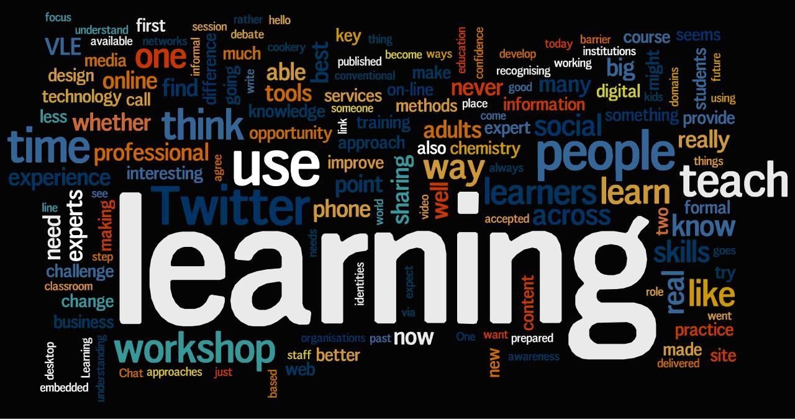
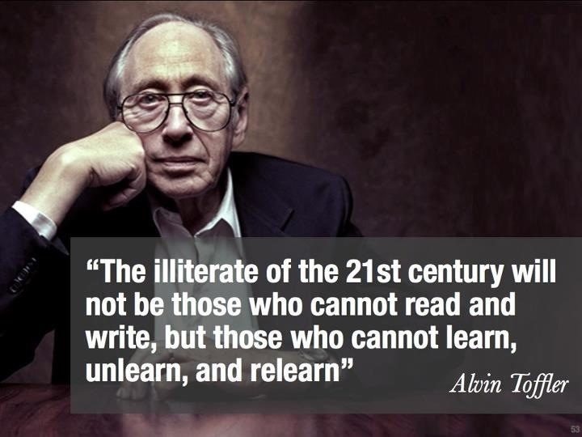
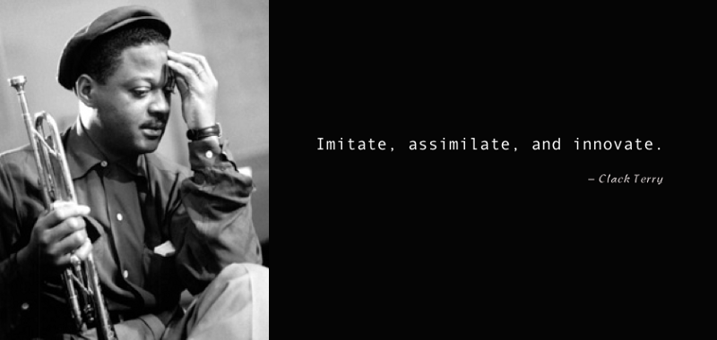
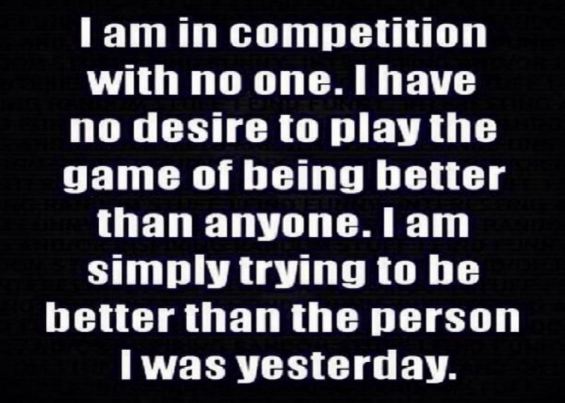

Learning unarguably is one of the greatest assets in human capital development. Learning itself can be a rewarding experience. One of the questions I have faced often is how to learn. I don’t have all the answers. But I made some costly mistakes that are avoidable.

After my graduation from college, I wanted to stay back in my institution as a lecturer. I’ve always wanted to be a one and that wouldn’t come as a surprise to my friends if I had ended up as one.

## The moment of truth …

My applications were not attended to on three separate occasions. So, I scheduled an appointment to meet with the Vice Chancellor via one of the former Senate Council members of the institution.

The response from the Vice Chancellor brought me to the point of re-evaluating my academic successes. He asked me to identify an IT related problem in the school and write a proposal on how to solve it. Then, I’d present the proposal to the institution’s Senate council and if it makes sense, I might be engaged in a consulting capacity.

At this point, my inadequacies became so clear to me.

What did I miss in my learning?

Why was I not confident enough to take up the challenge?

Could it be [impostor syndrome](https://counseling.caltech.edu/general/InfoandResources/Impostor)? Far from it.

It was rather the reality of life and the uniqueness of my career path that surfaced. I studied Computer Science and adjourned to have done very well but the vital aspect of my learning. The truth is that I traded my learning for certification.

At this point, I had two options to myself. Start learning the essentials of software development that I gamed to prove that I’m capable. This would take a lot of time to fill in the gap. Or, forget about the career.

Is classroom education bad? Certainly not.

Is classroom education all there’s to learning? Certainly not.

Is classroom education the best form of learning? Perhaps not.

Are they things we can make better? Definitely, yes.

I journeyed in the wrong path in all sincerity without realizing it until I was caught.

So, I was between opinions on how to learn until I heard about [andela](https://andela.com). The mission made sense to me. I jumped into the opportunity and luckily scaled through the rigorous selection exercise.

Now, it’s time to learn.

Should I follow the old track?

That’d be quick and pitch me as smart but it’d backfire. It was time to define a new strategy.

I was ready to get it right. I sacrificed speed this time. I focused on planning my new learning strategy. I crawled the web on a daily basis in search of materials on how to learn.

I found lots of amazing stuff on how to learn. Let me share a couple of them.

1. [Learn anything](https://simpleprogrammer.com/products/learn-anything/).

1. [Learning How to Learn](https://www.coursera.org/learn/learning-how-to-learn).

1. [You can Learn anything](https://www.khanacademy.org/youcanlearnanything).

1. [How people learn](https://www.nap.edu/read/9853/chapter/1).

1. [The Lesson You Never Got Taught in School: How to Learn!](http://bigthink.com/neurobonkers/assessing-the-evidence-for-the-one-thing-you-never-get-taught-in-school-how-to-learn)

## **Some gleanings from my mistakes**

### **1) Take ownership of your learning**

> Freeing yourself was one thing; claiming ownership of that freed self was another. - [Toni Morrison](https://www.brainyquote.com/quotes/quotes/t/tonimorris398352.html).

My major problem was learning just to scale through assessments. Unfortunately, this limits your learning to what perception you have of your instructor/assessor. When you leave your learning for somebody to manage, you loose sense of responsibility and purpose of learning. if you don’t take control of your education, you’d loose the essence thereof. The fastest way to make your learning matter in the real world is to take responsibility for your learning.

### **2) Avoid passive learning**

> Our obligation is to give meaning to life and in doing so to overcome the passive, indifferent life. - [Elie Wiesel](https://www.brainyquote.com/quotes/quotes/e/eliewiesel386793.html).

Every invention came out of curiosity and maybe challenging the current status quo. My approach was to swallow everything I was given in class and that was it. The cons of passive learning outweigh the pros. The result of passive learning is [surface processing](http://www2.rgu.ac.uk/celt/pgcerttlt/how/how5a.htm). It doesn’t engage the use of high-level [cognitive skills](http://sharpbrains.com/blog/2006/12/18/what-are-cognitive-abilities/).

Passive learning is learning without real world application in view. It’s not an optimal style of learning to be productive in a dynamic world like ours.

### **3) Don’t relinquish your creativity**

As explained in [Einstein: The Life and Times](https://www.amazon.com/Einstein-Times-Ronald-W-Clark/dp/0061351849),

> The value of an education in a liberal arts college is not the learning of many facts, but the training of the mind to think something that cannot be learned from textbooks.

Skepticism, keeping faith with the norm, always being realistic, procrastination, etc are killer viruses. They block your mind from endless possibilities and creative insights.

Consider some of the habits killing your creativity in [21 Ways to Kill Your Creativity.](http://www.creativitypost.com/create/21_ways_to_kill_your_creativity)

When it comes to learning, I go with [Clark Terry’s 3 steps to learning improvisation](http://www.jazzadvice.com/clark-terrys-3-steps-to-learning-improvisation/).

_Guiding principle for mastery_

### 4) Don’t compete with those ahead of you

I had a great sense of competition based on my understanding of the school structure. So instead of learning from others, I compete with them. I was once reminded by one of my instructors, [Ifeanyi Oraelosi](https://medium.com/u/1475b73d7463) not to compete with those that are in their end.

Envy only inspires unnecessary competition.

It’s more blessed to learn from others than compete with them. The danger here is self-delusion and being overwhelmed with so much information to learn in other to compete.

Fortunately, if you stay consistent in your learning, you’d get to your destination. The _process_ is more important than the _product_ in the school of learning.

### 5) Avoid trying to be good before you ever practice

> Tell me and I forget, teach me and I may remember, involve me and I learn.” ― [Benjamin Franklin](https://www.goodreads.com/author/show/289513.Benjamin_Franklin).

The fear of uncertainties and failures compels us to prepare before we ever practice. Practice has no substitute or alternative. Practice is engaging. Disappointment sets in when your brain can not solve what you thought you’ve studied.

Practice empowers and enables. It sets you on the path of glory and breaking boundaries.

Practice delivers you from the [illusions of competence.](https://staciechoice1010.wordpress.com/2014/08/15/illusions-of-learning-competence/) It makes learning a transformational experience altogether.

I couldn’t agree less with [John Sonmez](https://medium.com/u/56e8cba02b), the founder of [Simple Programmer.](https://simpleprogrammer.com/about-simple-programmer/) Spending so much time learning before you ever try to apply it is like trying to get good before you ever practice.

## **Conclusion:**

> Develop a passion for learning. If you do, you will never cease to grow. — [Anthony J. D’Angelo](https://www.brainyquote.com/quotes/quotes/a/anthonyjd153989.html).

Learning is a rewarding experience and should be approached in the context of real world applications.

Learning is more than having good grades.

Be proactive in your learning and you’re set to change your world.

Remember that knowledge is useless if you don’t apply it.

**Related Articles:**

1. [The Effective Learner: An Introductory Approach](../the-effective-learner-an-introductory-approach/).

2. [I’ve Got No Problem With Education](../ive-got-no-problem-with-education/).
