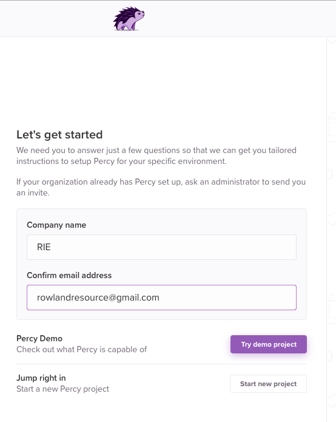
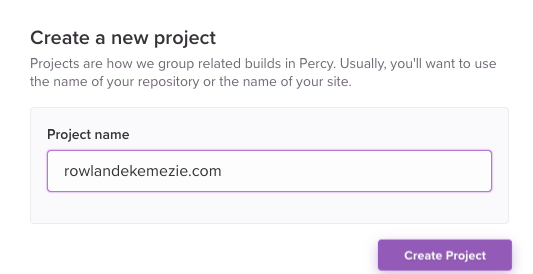
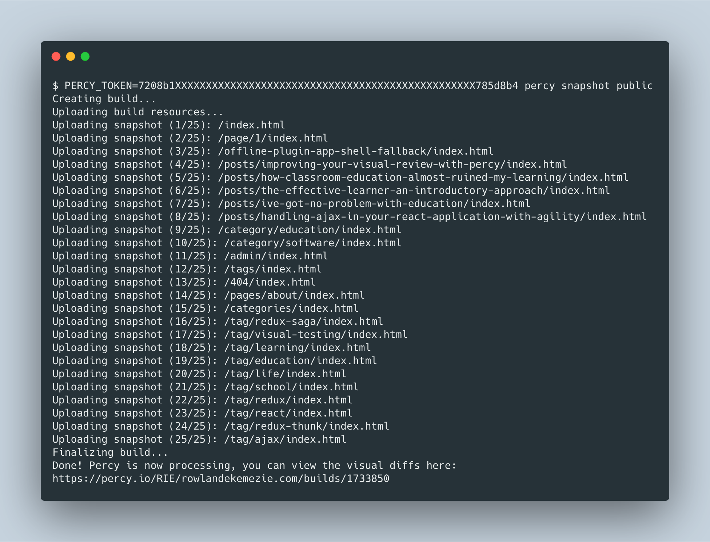
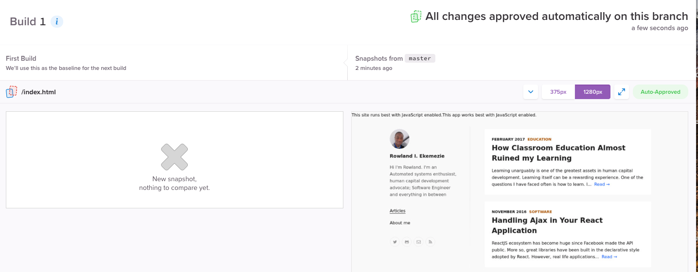
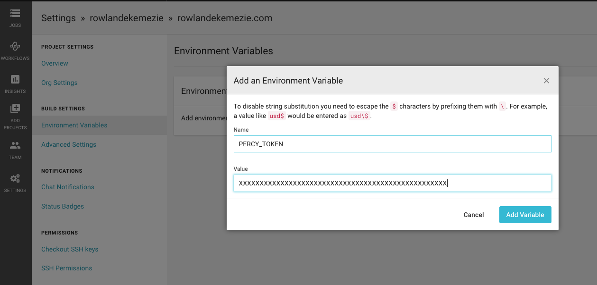
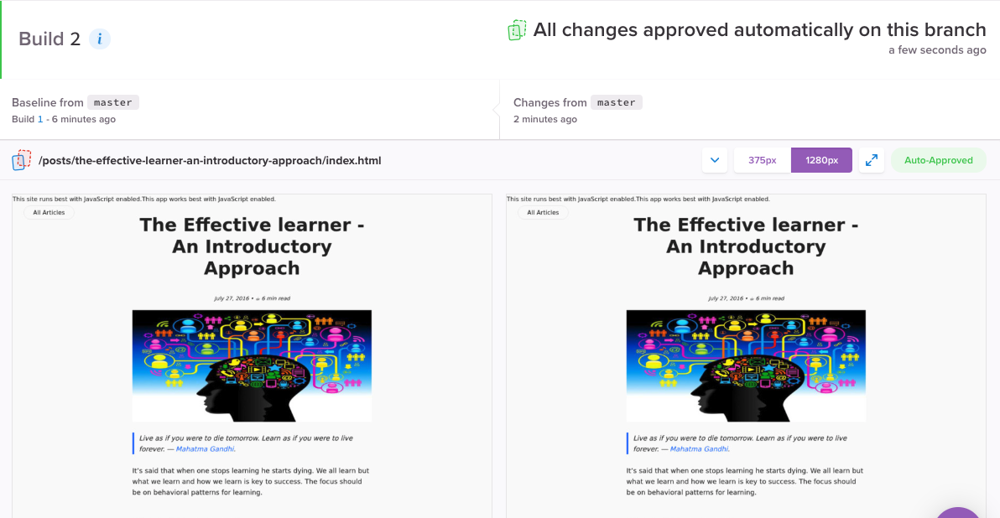
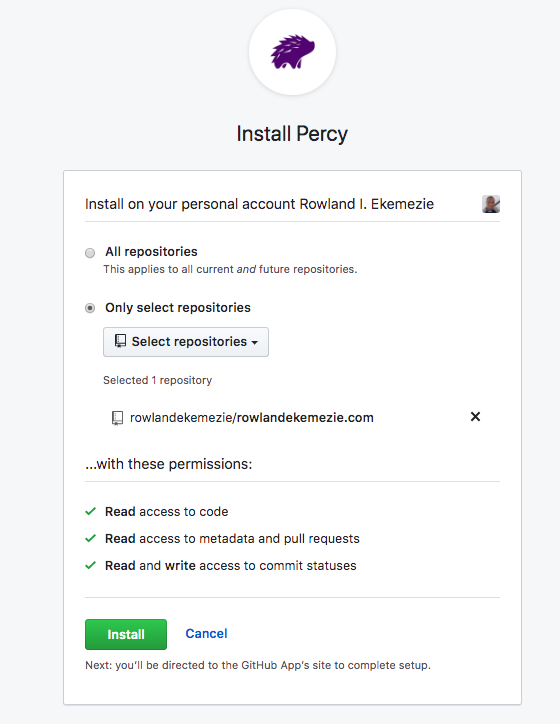
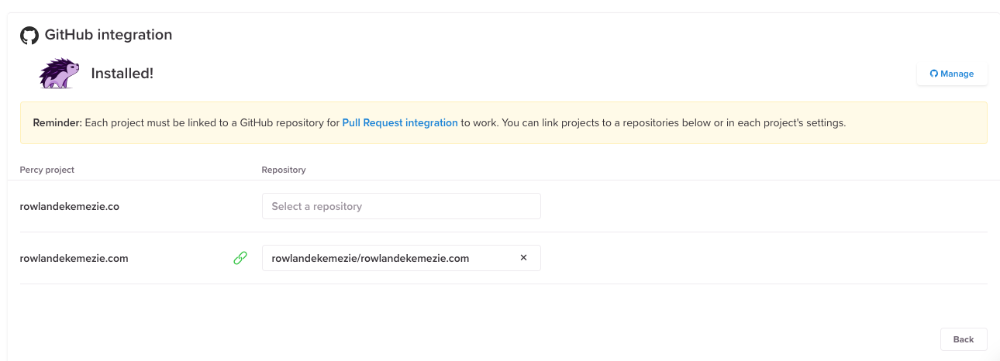
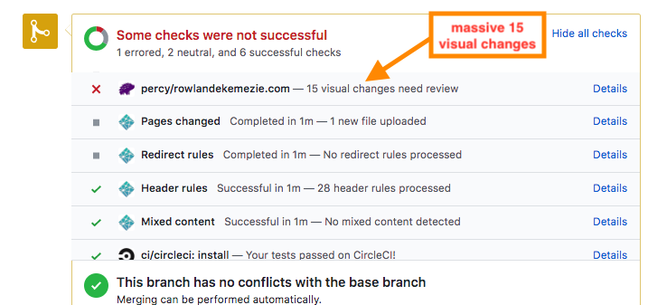
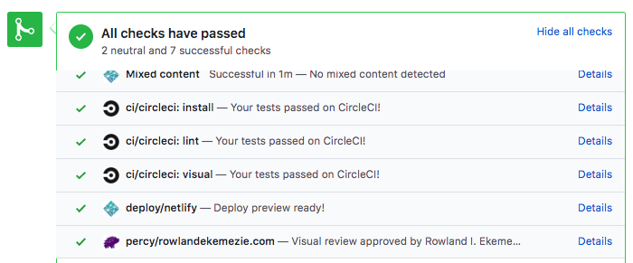

<i>Photo by Ken Treloar on Unsplash.</i>

### The problem
Your development team delivers lots of changes to client facing application. For the most part,  developers don't know when they've broken anything on the UI. You ship UI changes with less confidence not knowing if something broke. Whereas there are decent code review, manual QA and test coverage, they are still not enough to catch all UI bugs. One option is to go all out to engage more manual QA personnel. Alternatively,  find a scalable way of integrating automated visual reviews with immediate feedback cycle to improve the whole process and ship with confidence. 

### There're a few reasons for visual reviews:
- Manual QA is not scalable
- Visual regression testing is a life saver
- Automated feedback is a great gain
- Cross browser compatibility issues still live

### Why Percy
I think [percy](https://percy.io/) does a great job on the above issues. It integrates with your existing CI workflow, highlights visual diffs across browsers, screens and snapshots. The icing on the cake is the ability to review and approve these changes. Basically, Percy combines visual testings and review platform in one which is pretty cool.

> As, at the time of this writing, Percy is free for up to 5k snapshots monthly.

#### Let's walk through how to use Percy
I'd be integrating this to the [repository](https://github.com/rowlandekemezie/rowlandekemezie.com) that powers my personal website. It's made with [Gatsby](https://gatsbyjs.com) and deployed to [Netlify](https://netlify.com).

So, let's first clone the repository

```bash
git clone https://github.com/rowlandekemezie/rowlandekemezie.com.git
```

### Run Percy locally
You can configure percy-cli for testing locally
```bash
$ gem install percy-cli
```

Before we proceed, we'll need a *PERCY_TOKEN* which is *write-only* API key that only has access to create builds, snapshots, and upload resources to this project. So, signup on [percy](https://percy.io) with your GitHub account.

Next, create an organization name, confirmation email and click *Start new project*.



Next up is to add a project to your organization. Probably, a good idea to use the repository name.



All is set. Now, you have your *PERCY_TOKEN* which will be used for running the test locally and on CI.


Let's get back to the terminal to test it out locally with the token


> Ensure you run _yarn build_ first.

Click on the link generated below to review it on Percy platform.


> The left column is blank because there's no snapshot to compare against yet.

### Integrate percy with your CI workflow
We'll love to integrate percy to our CI workflow. It should run on every commit.

Let's use CircleCI for this. However, it works just fine with every other supported [CI platform](https://docs.percy.io/docs/ci-setup).

First, let's set up the project on CircleCI. login/signup to CircleCI with your GitHub account.

Click on *ADD PROJECTS* on the sidebar and then click on *Set Up Project* button for the project of choice.


We'll keep the default setting on the next page(Linux and Node) and follow other instructions.

Next up, create *.circleci/config.yml* in the root directory and populate with

```bash

version: 2

defaults: &defaults
  docker:
    - image: circleci/node:10.15.1
  working_directory: ~/repo

jobs:
  # install: ...

  # lint: ...

  visual:
    - image: circleci/ruby:2.6.2-node-browsers
    working_directory: ~/repo

    steps:
      - checkout
      - run:
          name: install dependencies
          command: |
            yarn install
            gem install percy-cli
      - run: 
          name: Run visual test
          command: |
            yarn build
            percy snapshot public
    
workflows:
  version: 2
  # test: ...
  visual-test:
      jobs:
        - visual
```

> I commented out few some jobs already existing in the project to help us focus on the scope of this article. When you're done testing, feel free to uncomment them 👌.


Commit and push your code to master. Head over to CircleCI click *Start building*. Hopefully, this is successful 👍

The build succeeds but because *PERCY_TOKEN* was not provided, the snapshots won't be pushed to percy.io for our review.


Let's fix it...

The same way we ran Percy locally with the *PERCY_TOKEN*, we'll add it to the environment variables. So, click on the settings Icon


Click on *Environment variables* in the sidebar to add your token

.

Commit your changes and push to master again.

Now, we can head to percy.io to see the snapshots created by the build.


> Percy automatically detects that there's no change hence, "All changes approved automatically on this branch".

### Link up Percy to your repository
The final part of this setup is to link Percy to our repository to get immediate feedback after each build.

In the project setting on Percy, click on _install an integration_ and choose *GitHub*.


Here you go...
Select the repository you want to install Percy and click *install*.



With the source code integration enabled, we can manage our pull request statuses, notifying us when visual changes are detected. It also gives a nice interface to approve those changes with the record of who approved the pull request.

Now you can select the repository to link to each project


### End to end test
Now, let's test everything together. Let's create a test branch and increase the _font-size_ of the content's title in _/components/Post/Content/Content.module.scss_. Commit the change and create a pull request.

```css
......

.content {

  &__title {
    font-size: $typographic-base-font-size * 4; // highlight-line
    max-width: $layout-post-width;
    ......
    ......
  }
```

This is a fantastic part of it. There are whooping 15 visual changes introduced by the font-size change.



You can click on details to take us straight to Percy to compare the changes

> The red font-colour on the right column only show the area of the UI affected by the change(s). You can click on it to see the actual changes.

We can approve the changes by clicking *Approve all* and boom all checks passed ✅



Percy gives you and your team the power to review and approve UI changes with confidence. You can build toolings around the capabilities it provides.


#### Further reading
- [Visual testing for storybook](https://docs.percy.io/docs/storybook).

- [Integrating percy with cypress](https://docs.percy.io/docs/cypress).

- [Integrating percy visual testing into existing framework](https://docs.percy.io/docs/build-your-own-sdk).

- [Configuring webhook events](https://docs.percy.io/docs/webhooks)

- [Cross browser visual testing](https://docs.percy.io/docs/cross-browser-visual-testing)

- [Responsive visual testing](https://docs.percy.io/docs/responsive-visual-testing)
