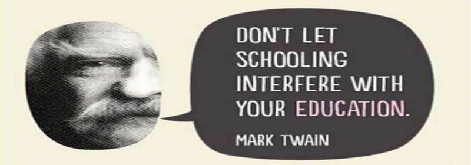

I was inspired by the last post on [The Effective Learner](https://rowlandekemezie.com/posts/the-effective-learner-an-introductory-approach). The responses I got were mind blowing and my response was, I’m not in it alone but more importantly, we can make a difference.
> Behind every exquisite thing that existed, there was something tragic. ― [Oscar Wilde](https://www.goodreads.com/author/show/3565.Oscar_Wilde)

You might have passed through the college, dropped out, at the brink of dropping out; your expectations might have been trampled and you’re frustrated and bored about the whole idea of schooling. Let’s walk through on why it’s so and how to probably focus on what matters most — *Education and Learning.*

### My experience with Academic seminars and Career talk

A couple of academic seminars I’ve organized and the ones I spoke in gave me a sense of how education has been misunderstood. The focus during such programs was answering some of the questions I receive daily on how I scaled the hurdle of running two courses concurrently and still came out with excellent result. I feel a great sense of respect in the air after such events and some would want to be my friend whereas some bow out with a feeling that I must be extraordinary.

In an attempt to provide genuine guidance having missed the whole essence of education in some aspects, the common question among participants was how to make best grades and maybe come out top of their class. They want a rule to nail it; an Almighty formula to perform the magic for them. I scarcely hear someone asking me how to learn these hard subjects — how to ensure I relate what I’m learning with what is obtainable in real life. This is terrible for our brain, educational system and the world at large. It’s heartbreaking that such has been allowed to almost perpetuate. Rather than ask real questions, people’s thoughts are centered on passing tests probably set by an individual. The truth is, <em>learn some tricks about passing exams without interest in the main purpose of learning, you become clueless afterwards.</em> This approach is myopic, ineffective, and obtrusive for learning.

### **Understanding the premise of the problem**
> We cannot solve our problems with the same thinking we used when we created them. — [Albert Einstein](http://www.brainyquote.com/quotes/quotes/a/alberteins121993.html?src=t_problems).

The premise of our problem is in comparing and contrasting education and schooling. Over the past couple of years, the wave of education surged like a tsunami across all nations. Whether we understand what we want and the essence of education is a great concern. Schooling was synonymous with education. If you went to school, you’re certified educated by the society. School system became the de facto standard of grading people’s level of education. The interest of every parent was to see their children go to school. We’ve a clue of what education could make out of any individual but the process was coaxed along the line.

Can schooling be said to be same as being educated? What could be fundamentally wrong with such thought? I would want to share my thoughts on two counts — the problem as well as recommendations.

[http://www.mrprintables.com/images/printable-quote-twain.jpg](http://www.mrprintables.com/images/printable-quote-twain.jpg)

**Creativity is the climax of learning**. Creativity is a clear demonstration of foundational knowledge and mastery of a craft. It’s the most crucial factor for future success. Doing something differently should be the learning outcome. The illusion of competence is in its climax if it’s about doing the same thing the same way. What gain is it to the student to give back an examiner the same thing, the same way it’s in a textbook during an examination?

Could it be the reason why some people who attended the supposedly prestigious institutions still drop out, frustrated by a system that is stereotyped?
> I failed in some subjects in exam, but my friend passed in all. Now he is an engineer in Microsoft and I am the owner of Microsoft. — **Bill Gate**.

**Lack of understanding of behavioral learning:** We judge people by the same standard as if we’re meant to solve the same problem afterwards. We fail to understand that people are peculiar and hence the problems they would solve in life drive their interests. We can’t coax everybody into the same system and expect a better result. Over-reliance on formal models and structure would devalue individual creativity. Insensitivity to contextual nuances makes learning boring.

**Unnecessary focus on tests as the rubric for excellence:** Whereas our test focuses on the product, it does not go down well with understanding the processes most times. What’s most important is the process because it can be scaled to achieve different goals. Students of different colleges seek to know how to make the best grade. Is first class the reason for schooling? Is first class the justification for excellence in real life context. Personally, I don’t think it’s near the expectation. Understandably, it’s an indication of great potential but not a justification for it. Because tests are usually not a symlink of real world situations, their abstraction makes the interest of learners wither as they lack connection with what people face.

**The culture is wrong:** School culture over emphasized a truth and it leads to an error. Testing was to consolidate learning; give and receive feedback from students on what works and what doesn’t in an attempt to better the system and the society. When it became the yardstick of measurement and comparison, the essence was corrupted. Unconsciously, the attention of learners turned toward passing tests at the expense of the **what**, **why**, and **where** of education. When the purpose is jettisoned, anything competes for the role.

**The school system needs a redefinition:** School system was meant to be the hallmark of education and learning. There’s no problem with education. The problem is with the current system we largely operate. People have been educated without the system and we study about them in our schools these days.

[Newton](http://www.biography.com/people/isaac-newton-9422656#early-life) graduated with no honors or distinctions but his efforts won him the title of a scholar and four years of financial support for future education.

[Thomas Edison](http://www.biography.com/people/thomas-edison-9284349#synopsis), the inventor with the highest number of patents — 1100, had his formal education stopped at the age of 12, but his whole life was consumed by a passion for self-education.

Arguably, the most certified academically are usually not the game changers; one thing is constant, though — *education*. Some resounding impact has been made by some people who dropped out of school or just completed the basic educational curriculum. It’s a clear indication that there’s nothing wrong with education as it remains constant, but the school system needs reformation to meet her goals for learning.

Several institutions now try to simulate real life scenario for learning. Some move from the classroom paradigm to a classless system of learning; some prefer to call it training all because the school system has always needed a remedial.

Getting the priority right is crucial for restructuring our educational system. If the foundation is steadied at learning and processes revolve around customizing different educational experiences for everybody, then the world is in for a radical transformation and resounding inventions.

## **Certificate Doesn’t Justify Competence**

Arguably, some institutions have better structures to ensure better learning experience and hence, better graduates. However, sentiments in the labor market and the society make it difficult to know who knows what against the certificate they possess. Definitely, we got it all wrong somewhere. Arguments might be with the premise of the pedigree of such institutions or past successes and might not be any of having better learning structure or right educational technique to ensure they graduate better students. When priority is misplaced, the substance is threaded for chaff and content for the packaging. If competence is not the interest, learning is jettisoned for whatever is acceptable. Looking beyond the certificates allows you to focus on learning that ensures competence.

## Nebulous Theory Doesn’t Scale

Back then in school, some information is termed academic, connoting some things are in the academic domain and others in real life domain. Sadly, we spend most of our time on the impracticable and ignore the real context. What a deception that lurks in our educational system. Practical standards are more reasonable and undo emphasis on ideal standards as benchmark for effectiveness deters the whole process of learning. To give more context to this, idealistic standards doesn’t allow creativity and intuition to operate. An eye on the ideal encourages learning devoid of practice whereas practical oriented approach to learning enforces inventiveness and creativity.

Prefer <em>walking the walk</em> to <em>talking the walk.</em> Theories can not get you very far in your learning. Theories could become a [second-order incompetence syndrome](http://www.billthelizard.com/2008/11/on-learning.html) if not checked.

## **Key Takeaways**
> The function of education is to teach one to think intensively and to think critically. Intelligence plus character — that is the goal of true education. — [Martin Luther King, Jr](http://www.brainyquote.com/quotes/quotes/m/martinluth402936.html?src=t_education.).

I’ve got no problem with education, neither do you. Learning is part of human existence. Definitely, educational institutions need restructuring but education must be pursued with the right perception.

Carl Rogers once said, <em>The only person who is educated is the one who has learned how to learn and change.</em> Once you know the essence of education and learning, your focus is shifted to knowing how to learn effectively.

Education is a common currency. It trades at the same rate everywhere and every time. It’s a treasure for action at all times. In Herbert Spencers’ words, <em>The great aim of education is not knowledge but action.</em>

Education is powerful; it’s a golden key and weapon for a successful life. Education is the fragment that remains after we’ve left school. What really matters may not be good grades in school, but a different way of looking at the world, problems, and learning. Education is life; learning is a skill; school is meant to serve the process.

**Related Articles:**

1. [The Effective Learner: An Introductory Approach](https://rowlandekemezie.com/posts/the-effective-learner-an-introductory-approach).

2. [How class room education almost ruined my learning](https://rowlandekemezie/posts/how-classroom-education-almost-ruined-my-learning).

**Spread The News…**
