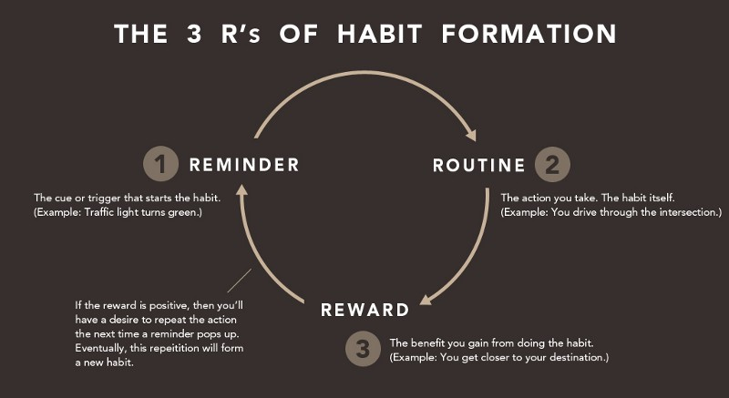

> Live as if you were to die tomorrow. Learn as if you were to live forever.
― [Mahatma Gandhi](https://www.goodreads.com/author/show/5810891.Mahatma_Gandhi).

It’s said that when one stops learning he starts dying. We all learn but what we learn and how we learn is key to success. The focus should be on behavioral patterns for learning.

### Where did it go wrong?

In 2009, [a study conducted by](http://learninglab.psych.purdue.edu/downloads/2012_Karpicke_CDPS.pdf) Purdue University asked 177 college students:

(1) to list strategies they used when studying (an open-ended free report question) and

(2) to choose whether they would reread or practice recall after studying a textbook chapter (a forced report question).

The results of both questions point to the same conclusion: A majority of students repeatedly read their notes or textbook (despite the limited benefits of this strategy), but relatively few engage in self-testing or retrieval practice while studying. This strategy of learning births illusion among students about their competence.

Focus on providing content to students without training them on how to acquire it is counter productive. What to learn and how to learn them are all important aspects of learning that has been largely overlooked.

Life is a learning process and whether people know it or not, they’re learning daily. What they learn and how they learn is the matter.

A mid-level developer once said to me that he gets his work done using Stack Overflow. Whereas ESME(Eliminating Stupid Mental Effort) is key in life, learning must not be compromised under the guise of any.

### My story

After graduating with first class in computer science and distinction in Electrical/Electronics Engineering(9 years in the college), I found something missing in my arsenal. What could that be? Was it an M.Sc? Far from it. You could say I’m an ingrate and might wish to believe it’s a joke. The irony of it is that I failed. Whereas end products are what people celebrate, what is most important for personal development is how success was gotten — the process. Processes could be maneuvered in an attempt for quick results. Unfortunately, this approach would haunt any man latter on. The way I see success is being able to succeed in succession and that makes it critical that the path to success be clean and proper.

In my adventure for learning and excellence, I channeled my quest towards getting the job done thinking that was all there was to it. Far from it. What I observed after all the supposed academic successes was that I forgot whatever I thought I’ve learnt in the process and never made meaning out of it. That’s what I call the labour of foolishness. I was celebrated and considered a genius but I was basically in the path of doom without realizing. This was as a result of gambling with the content without understanding the rudiments for effective learning and productivity. I wish I knew earlier than now.

### **Three school of thought about learning**

I observed three versions of learning as a summary when I try to see how people actually learn. I may categorize them as three schools of thoughts. Whereas two are distinct, the third is a conglomerate of both. The thought that we ***learn by doing*** is practically oriented and the thought that we ***learn to do*** is theoretically oriented but the conglomerate of both could be termed “isomorphically oriented”.

For the practically-oriented folks, they are productive and almost always deliver at all times. The downside to it is that people can get job done without learning from it. Learning is different from just getting stuff done or not getting it done. When you learn by doing, doing is only an accelerator to finding out what works and what doesn’t work in real time. People don’t learn just because they did something. People learn because they gave attention to why it worked or didn’t work. My take is that effective learning is a combination of several factors which practice(doing) is just one of them.

Let’s get down into some of the basic factors for learning.

### LEARNING: THE WHY FACTOR

> Any fool can know. The point is to understand.
― [Albert Einstein](https://www.goodreads.com/author/show/9810.Albert_Einstein)

Making proper connections around the premise of the new material you’re learning and how they interleave with each other involves understanding. It’s usually easy to resort to cookie-cutter, do-as-you-see, and do-as-you-are-told mindless approach when following a worked out tutorial. It’s easy to focus on what worked and mindlessly forgetting the connections they make with the next step. It is the understanding of the interconnectedness between steps that guarantees the creative use of the material and it’s mastery forthwith. Understanding is principal in learning any material or art effectively.

### LEARNING: THE HABIT FACTOR

> We are what we repeatedly do. Excellence, then, is not an act, but a habit. -**Aristotle**.

Focus on goals rather than habits might be the easiest way to abort passion and love for a new material you’re learning. Goals are met when habits are formed. Habits connect all resources to meet a goal. Habits help build processes that you can leverage subconsciously to deliver a product. Habit is the operation manager that coordinates and brings every tiny piece together into actualizing a goal. When learning is the reason, setting goals is not a priority.

### LEARNING: THE COMMUNITY FACTOR

> The parts of me that used to think I was different or smarter or whatever, almost made me die.
― [David Foster Wallace](https://www.goodreads.com/author/show/4339.David_Foster_Wallace).

The supposedly intelligent and the so-called geniuses usually think that joining a community or building a community to learn with is a waste of time. Isolation from the force of a community is deadly for learning. Most people would usually not reach the zenith of their dreams because of divorce with community factor and unfortunate friendship with isolation. Those that fall into this category quickly grasp materials more than any one else but lack the cutting edge that community forces brings with it. This is usually the separating line between the intelligent and the brilliant.

### LEARNING: THE PRACTICE FACTOR

> For the things we have to learn before we can do them, we learn by doing them. ― [Aristotle](https://www.goodreads.com/author/show/2192.Aristotle).

### **Pros of practice testing**

1. Ensures memory retention and comprehension.

1. Focused practice and repetition helps to build chunks for being an expert in the material you’re learning.

1. Practice testing deals with the illusion of competence.

Effective learning starts with learning the right strategies to learn. I feel it’s more important to learn how to learn than just learning multiple contents without any guarantee of long lasting retention. I would like to keep this article brief and continue in subsequent articles to express strongly how to learn effectively.

**Related articles:**

1. [I’ve got no problem with education](https://rowlandekemezie/ive-got-not-problem-with-education).

2. [How class room education almost ruined my learning](https://rowlandekemezie/how-classroom-education-almost-ruined-my-learning).